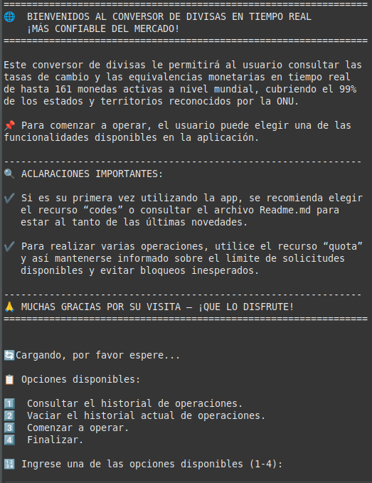
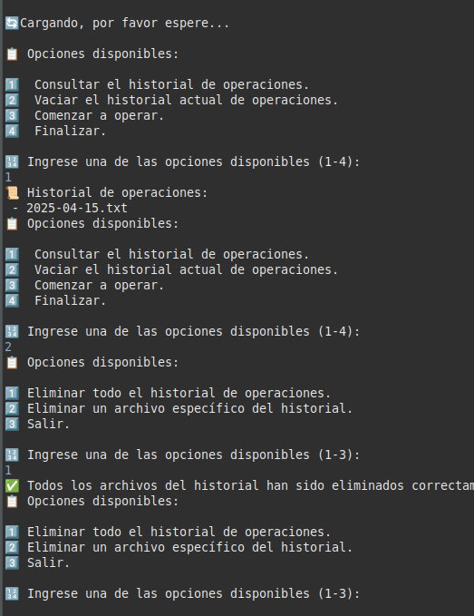
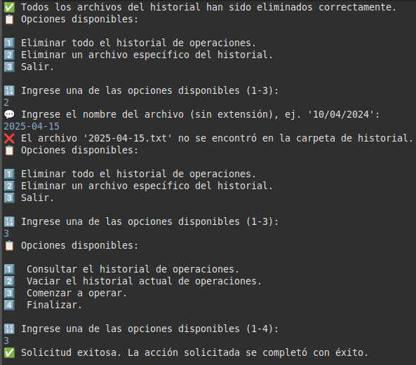
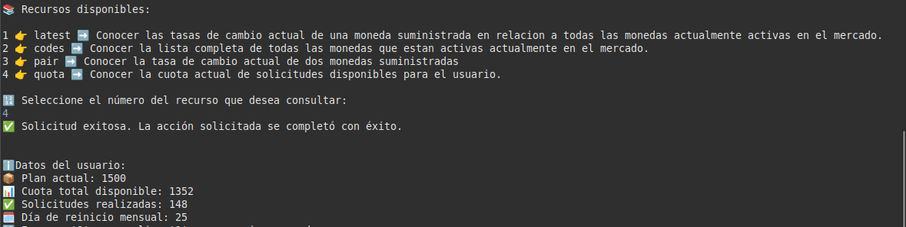

  <strong>💱 Conversor de Monedas en Tiempo Real 💱</strong>

  
  
  

# 📑 Índice

1. 📌 [Descripción del Proyecto](#descripción-del-proyecto)
2. 🧩 [Características Principales](#características-principales)
3. ⚙️ [Tutorial de Instalación](#tutorial-de-instalación)
4. 📚 [Documentación Adicional](#documentación-adicional)
5. 🚧 [Próximas Actualizaciones](#próximas-actualizaciones)
6. 👥 [Autores](#autores)

## 📌 Descripción del Proyecto

Este proyecto nació como parte de un desafío propuesto durante mi formación académica en **Alura Latam**, en colaboración con **Oracle Education**.

La aplicación desarrollada es un **Conversor de Divisas en Tiempo Real**, diseñado para permitir a los usuarios consultar las **tasas de cambio** y las **equivalencias monetarias** de hasta **161 monedas activas** a nivel mundial, cubriendo aproximadamente el **99% de los países y territorios reconocidos por la ONU**.

## 🧩 Características Principales

La aplicación obtiene sus datos a través de la API de **ExchangeRate** (disponible en [https://www.exchangerate-api.com](https://www.exchangerate-api.com)), la cual proporciona acceso a tasas de cambio actualizadas constantemente. Gracias a esta fuente, el sistema puede reflejar en tiempo real los cambios en el mercado global de divisas.

### 🔐 Control de Solicitudes

Con el objetivo de evitar un uso excesivo de recursos y controlar la cantidad de solicitudes realizadas a la API, todos los usuarios dependen de la cuenta del **usuario administrador**, compartiendo la misma cuota mensual. Actualmente, esta cuota permite realizar hasta **1.500 solicitudes mensuales**.

Una vez alcanzado dicho límite, el acceso a la API será bloqueado hasta el inicio del siguiente período mensual, momento en el cual la cuota será restablecida. La aplicación permite consultar el estado de la cuota actual, lo cual facilita al usuario administrador el seguimiento de las solicitudes ya realizadas y aquellas aún disponibles, contribuyendo así a la continuidad del servicio.

**Importante:** cualquier usuario que desee contar con una cuota independiente, puede registrarse en el servidor de la API a través del siguiente enlace: [https://app.exchangerate-api.com/sign-up](https://app.exchangerate-api.com/sign-up). Una vez obtenido el identificador de acceso (**ApiKey**), deberá dirigirse al archivo **`Config.java`** ubicado dentro del paquete **`connection`**, y reemplazar el valor de la constante **`API_KEY`** con su clave personal.

  

### 🚀 Funciones Gratuitas y Premium

La API de ExchangeRate ofrece tanto **funciones gratuitas** como **funcionalidades avanzadas bajo suscripción**. En su estado actual, la aplicación emplea únicamente el acceso gratuito, el cual resulta suficiente para realizar consultas y conversiones básicas de divisas.

## ✅ Funcionalidades Disponibles

Las funcionalidades disponibles en la aplicación permiten al usuario consumir una variedad de recursos de la API a través de **cuatro endpoints principales**:

- **`latest`**: Tasa de cambio actual de una moneda con respecto a todas las demás. 
- **`codes`**: Lista completa de monedas activas. 
- **`pair`**: 
  - Tasa entre dos monedas. 
  - Tasa + monto para calcular equivalencias. 
- **`quota`**: Estado de solicitudes disponibles para el usuario.

La aplicación incluye un **historial de operaciones**, separado por fecha (por ejemplo, `17-04-2025.txt`) y hora. El usuario puede vaciar todo el historial o eliminar archivos específicos.

### 🖼 Vista de la Aplicación

  

  

  

## 🧪 Ejemplo de Uso

- **`latest`** 

  

- **`codes`** 

  

- **`pair`** 

  

  

- **`quota`** 

  

## ⚙️ Tutorial de Instalación

1. Instalar un IDE compatible con Java (Eclipse, VS Code). 
2. Instalar Java Development Kit (JDK 21 recomendado). 
3. Clonar o descargar este repositorio. 
4. Importar como proyecto Java existente en el IDE. 
5. Ejecutar `Main.java` dentro del paquete `app`. 
6. Acceder al historial en la carpeta `History` dentro del directorio `users`. 
7. La dependencia **Gson** ya está incluida en el proyecto, no se requieren configuraciones adicionales.

## 📚 Documentación Adicional

- 📄 [Documentación técnica oficial](https://www.exchangerate-api.com/docs/overview) 
- 📝 [Crear cuenta personal (ApiKey)](https://app.exchangerate-api.com/sign-up) 
- 💼 [Planes y servicios premium](https://www.exchangerate-api.com/#pricing) 

## 🚧 Próximas Actualizaciones

- Para resolver el problema de dependencia en los usuarios que comparten una misma clave y un mismo límite de quota, se implementará un método de autenticación llamado **Token Bearer**. 
- Por el momento el proyecto es solo backend, pero se piensa desarrollar una interfaz de usuario para evitar tener que interactuar siempre desde consola. 
- Se ofrecerán mejoras en la estructura y el modo de organización del historial de los usuarios.

## 👥 Autores

Proyecto desarrollado por **Martín Lorenzi**.  
Contacto: [alorenzi@alumnos.exa.unicen.edu.ar](mailto:alorenzi@alumnos.exa.unicen.edu.ar)  
Perfil en LinkedIn: [Martín Lorenzi - LinkedIn]()
